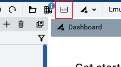
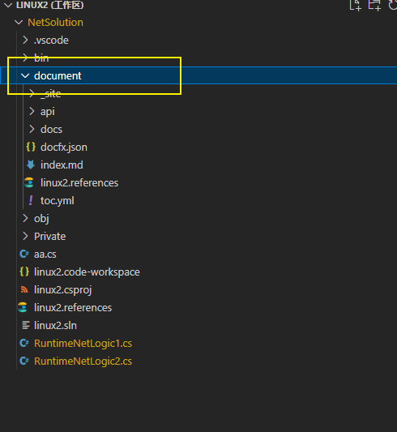
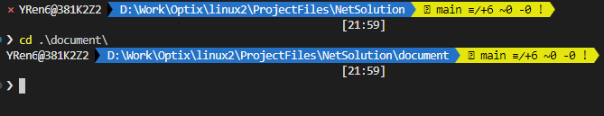
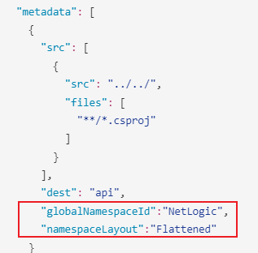
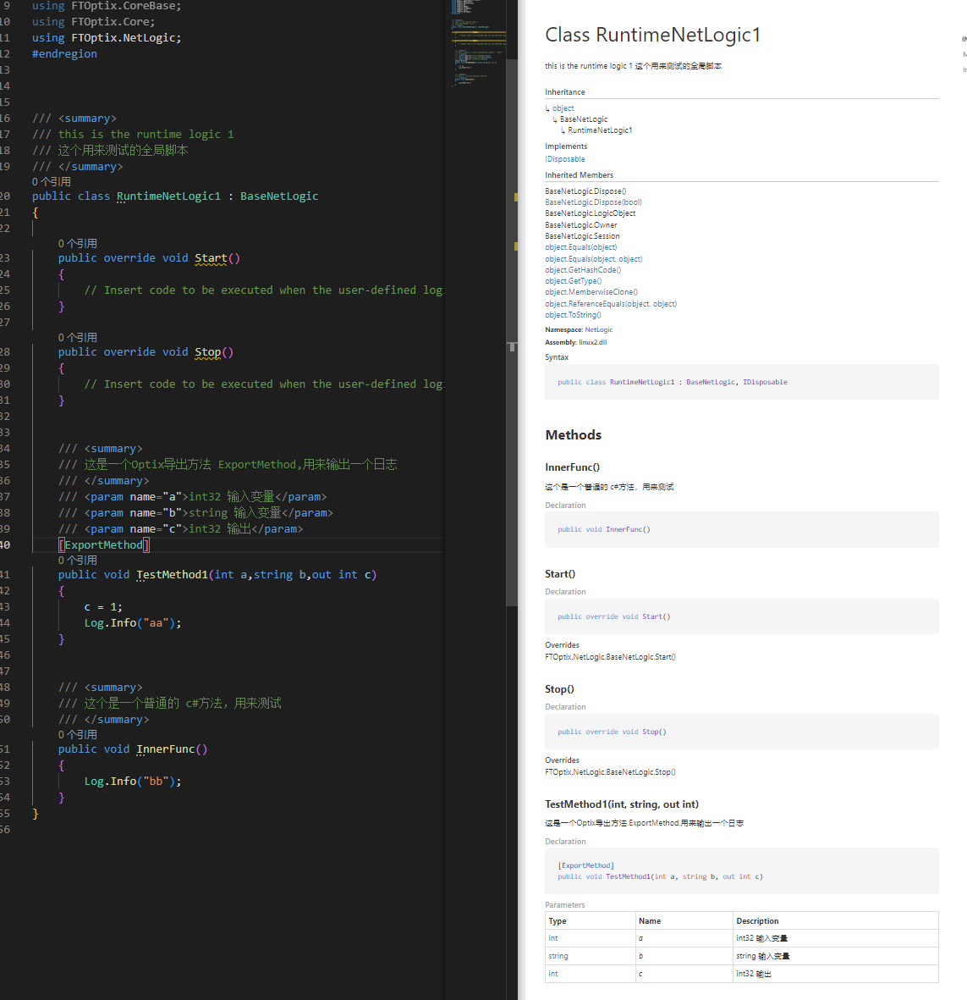

**注意，本文所讲的API，为基于对代码注释而自动生成的开发文档**


docfx 是一个开放源代码静态站点生成器，可以从源代码和 Markdown 文件生成文档。


github :[传送门](https://github.com/dotnet/docfx)

官网 : [传送门](https://dotnet.github.io/docfx/index.html)

学习视频: [传送门](https://learn.microsoft.com/en-us/shows/on-net/intro-to-docfx)

快速入门 :[传送门](https://dotnet.github.io/docfx/index.html)


## 安装

    前置条件

    - 熟悉命令行
    - 安装 .NET SDK 6.0 或 更高


```shell
dotnet tool update -g docfx
```


## 在Optix项目建立代码文档

#####打开Optix NetSolution



### 新建 `document` 文件夹用来存放文档材料



### 创建 `docfx` 项目
   打开命令行,并定位到 `document` 文件



### 初始化项目目录
  
```
docfx init -q
```

-q 这个参数表示忽略询问，直接生成。如果需要自定义配置，可取消 -q 这个参数。

目录结构如下:

```
docfx_project 
.
├── api
│   ├── index.md
│   └── toc.yml
├── apidoc
├── articles
│   ├── intro.md
│   └── toc.yml
├── docfx.json
├── images
├── index.md
├── src
└── toc.yml
```

### 配置 `docfx` 项目

打开 docfx.json 文件

内容改为如下:

```js
{
  "metadata": [
    {
      "src": [
        {
          "src": "../../",
          "files": [
            "**/*.csproj"
          ]
        }
      ],
      "dest": "api",
      "globalNamespaceId":"NetLogic"
    }
  ],
  "build": {
    "content": [
      {
        "files": [
          "**/*.{md,yml}"
        ],
        "exclude": [
          "_site/**"
        ]
      }
    ],
    "resource": [
      {
        "files": [
          "images/**"
        ]
      }
    ],
    "output": "_site",
    "template": [
      "default",
      "modern"
    ],
    "globalMetadata": {
      "_appName": "mysite",
      "_appTitle": "mysite",
      "_enableSearch": true,
      "pdf": true
    }
  }
}
```

其中最主要是如下这项，其他可以不用管




## 构建 `docfx` 项目

### 检索元数据
从 .net项目中提取信息

```
docfx metadata
```


### 创建 html

```
docfx build
```
默认的输出内容在 `_site` 文件夹中 


也可以使用如下命令，进行创建和测试
```
docfx build --serve
```

```
Searching custom plugins in directory C:\Users\yren6\.dotnet\tools\.store\docfx\2.75.3\docfx\2.75.3\tools\net6.0\any\...
Post processor ExtractSearchIndex loaded.
No files are found with glob pattern images/**, excluding <none>, under directory "D:\Work\Optix\linux2\ProjectFiles\NetSolution\document"
6 plug-in(s) loaded.
Building 3 file(s) in ConceptualDocumentProcessor(BuildConceptualDocument=>ValidateConceptualDocumentMetadata)...
Building 3 file(s) in TocDocumentProcessor(BuildTocDocument)...
Building 10 file(s) in ManagedReferenceDocumentProcessor(BuildManagedReferenceDocument=>SplitClassPageToMemberLevel=>ValidateManagedReferenceDocumentMetadata=>ApplyOverwriteDocumentForMref=>FillReferenceInformation)...  
Applying templates to 16 model(s)...
XRef map exported.
Extracting index data from 13 html files
Serving "D:\Work\Optix\linux2\ProjectFiles\NetSolution\document\_site" on http://localhost:8080. Press Ctrl+C 
to shut down.
```

可以用浏览器 http://localhost:8080 端口查看效果


### 导出 pdf

```
docfx pdf
```

### 发布/分享给用户

 - 网页发布

通过 web server 接入目录 `_site` 即可访问

 - PDF分享


### 示例




## c#的注释格式说明

微软官方说明 [传送门](https://learn.microsoft.com/en-us/dotnet/csharp/language-reference/language-specification/documentation-comments)


示例：
```cs
namespace Graphics
{
    /// <summary>
    /// Class <c>Point</c> models a point in a two-dimensional plane.
    /// </summary>
    public class Point
    {
        /// <value>
        /// Property <c>X</c> represents the point's x-coordinate.
        /// </value>
        public int X { get; set; }
        
        /// <value>
        /// Property <c>Y</c> represents the point's y-coordinate.
        /// </value>
        public int Y { get; set; }
        
        /// <summary>
        /// This constructor initializes the new Point to (0,0).
        /// </summary>
        public Point() : this(0, 0) {}
        
        /// <summary>
        /// This constructor initializes the new Point to
        /// (<paramref name="xPosition"/>,<paramref name="yPosition"/>).
        /// </summary>
        /// <param name="xPosition">The new Point's x-coordinate.</param>
        /// <param name="yPosition">The new Point's y-coordinate.</param>
        public Point(int xPosition, int yPosition) 
        {
            X = xPosition;
            Y = yPosition;
        }
        
        /// <summary>
        /// This method changes the point's location to
        /// the given coordinates. <see cref="Translate"/>
        /// 
        /// <sample>
        /// 
        /// Sample 1
        /// 
        /// <code>
        /// var x = 100;
        /// var y = 200;
        /// point.Move(x,y);
        /// </code>
        /// </sample>
        /// </summary>
        /// <param name="xPosition">The new x-coordinate.</param>
        /// <param name="yPosition">The new y-coordinate.</param>
        public void Move(int xPosition, int yPosition) 
        {
            X = xPosition;
            Y = yPosition;
        }
        
        /// <summary>
        /// This method changes the point's location by
        /// the given x- and y-offsets.
        /// <example>For example:
        /// <code>
        /// Point p = new Point(3, 5);
        /// p.Translate(-1, 3);
        /// </code>
        /// results in <c>p</c>'s having the value (2, 8).
        /// <see cref="Move"/>
        /// </example>
        /// </summary>
        /// <param name="dx">The relative x-offset.</param>
        /// <param name="dy">The relative y-offset.</param>
        public void Translate(int dx, int dy)
        {
            X += dx;
            Y += dy;
        }
        
        /// <summary>
        /// This method determines whether two Points have the same location.
        /// </summary>
        /// <param name="o">
        /// The object to be compared to the current object.
        /// </param>
        /// <returns>
        /// True if the Points have the same location and they have
        /// the exact same type; otherwise, false.
        /// </returns>
        /// <seealso cref="operator=="/>
        /// <seealso cref="operator!="/>
        public override bool Equals(object o)
        {
            if (o == null)
            {
                return false;
            }
            if ((object)this == o) 
            {
                return true;
            }
            if (GetType() == o.GetType()) 
            {
                Point p = (Point)o;
                return (X == p.X) && (Y == p.Y);
            }
            return false;
        }

        /// <summary>
        /// This method returns a Point's hashcode.
        /// </summary>
        /// <returns>
        /// The int hashcode.
        /// </returns>
        public override int GetHashCode()
        {
            return X + (Y >> 4);    // a crude version
        }
        
        /// <summary>Report a point's location as a string.</summary>
        /// <returns>
        /// A string representing a point's location, in the form (x,y),
        /// without any leading, training, or embedded whitespace.
        /// </returns>
        public override string ToString() => $"({X},{Y})";
        
        /// <summary>
        /// This operator determines whether two Points have the same location.
        /// </summary>
        /// <param name="p1">The first Point to be compared.</param>
        /// <param name="p2">The second Point to be compared.</param>
        /// <returns>
        /// True if the Points have the same location and they have
        /// the exact same type; otherwise, false.
        /// </returns>
        /// <seealso cref="Equals"/>
        /// <seealso cref="operator!="/>
        public static bool operator==(Point p1, Point p2)
        {
            if ((object)p1 == null || (object)p2 == null)
            {
                return false;
            }
            if (p1.GetType() == p2.GetType())
            {
                return (p1.X == p2.X) && (p1.Y == p2.Y);
            }
            return false;
        }
        
        /// <summary>
        /// This operator determines whether two Points have the same location.
        /// </summary>
        /// <param name="p1">The first Point to be compared.</param>
        /// <param name="p2">The second Point to be compared.</param>
        /// <returns>
        /// True if the Points do not have the same location and the
        /// exact same type; otherwise, false.
        /// </returns>
        /// <seealso cref="Equals"/>
        /// <seealso cref="operator=="/>
        public static bool operator!=(Point p1, Point p2) => !(p1 == p2);
    }
}
```