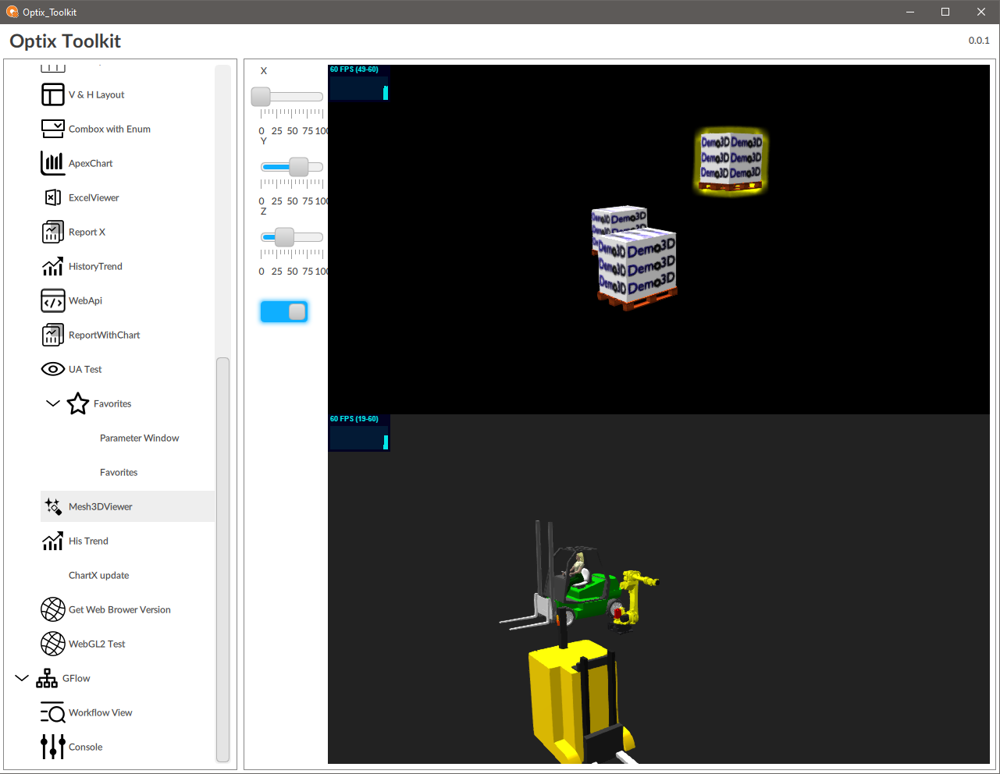
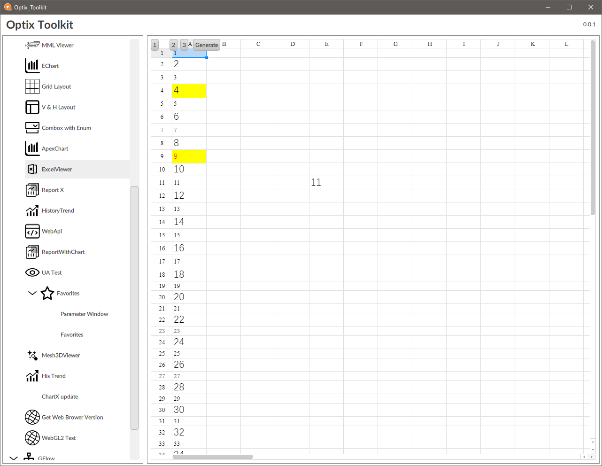
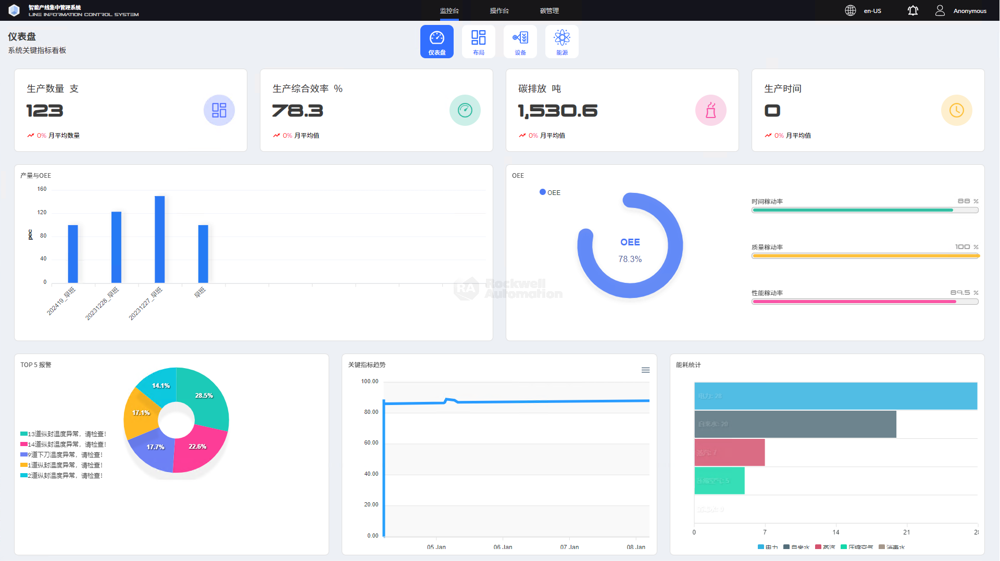
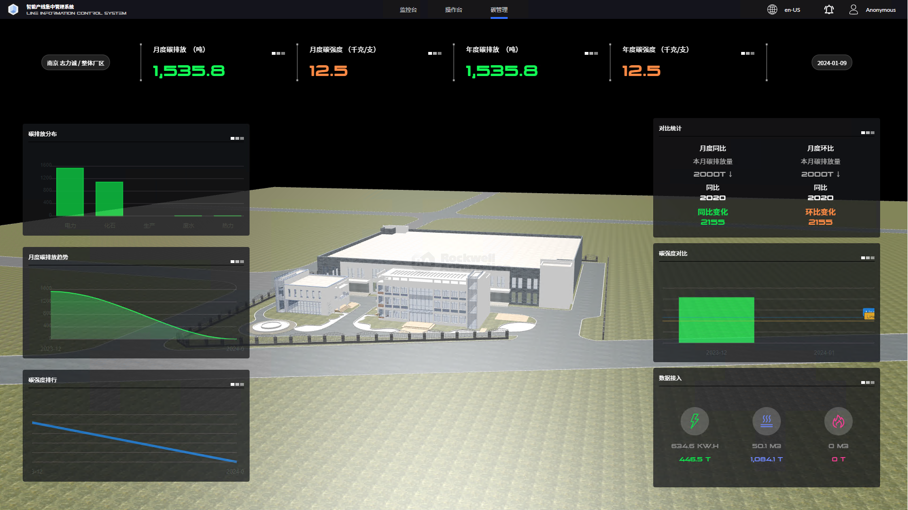

这个一个FTOpitix文档库,记录一些使用技巧和内容
项目采用团队合作开发 ，[仓库地址](https://github.com/Rockwell-China-GOTC/FTOptixDocs.git)

### 简介

本网站这是针对FTOptix软件建立的文档系统，包括:

- 使用说明
- 最佳实践
- 代码库
- 小知识

### 演示项目

1. **Optix_Toolkit** [下载](/attchs/Optix_Toolkit.optix.z) 
  - 一些新框架，新技术的演示项目

  - 嵌入Threejs 、双向通讯、事件响应
  - 嵌入 Excel Sheet
  
  截图

  

  

2. **Web应用** [下载](/attchs/LICS_V4.optix.z) 
  -  演示通过浏览器控件，扩展Web应用： 3D,Chart
  -  Rest API 和 WebSocket 进行后台数据交互

  截图
  
  

  

### Bug提交

- EMail : yi.ren@rockwellautomation.com

---

**目前只有中文版**

