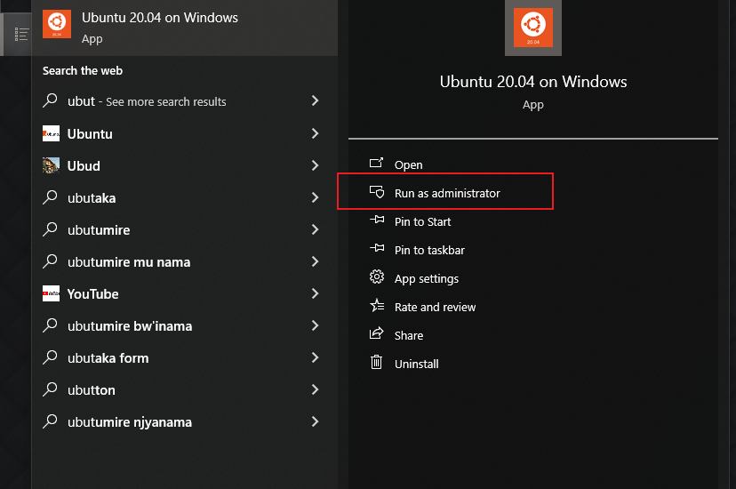
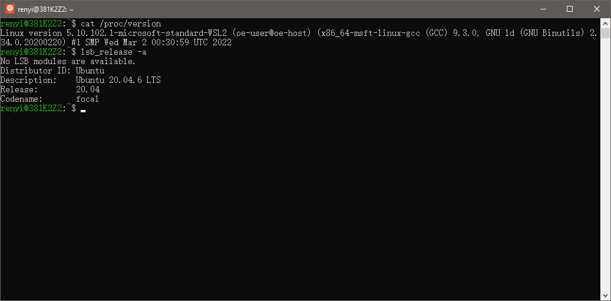
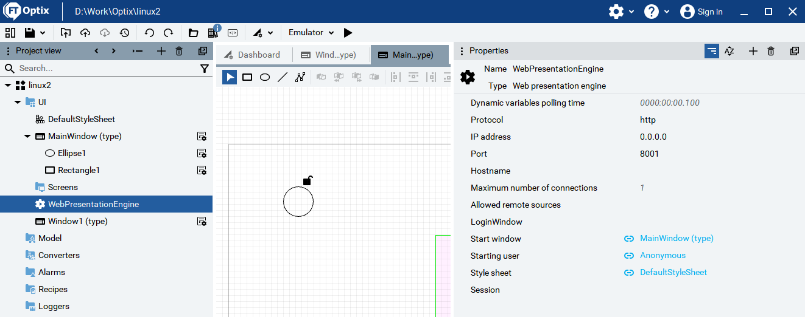
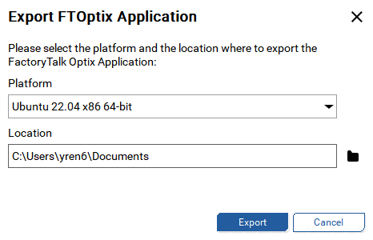
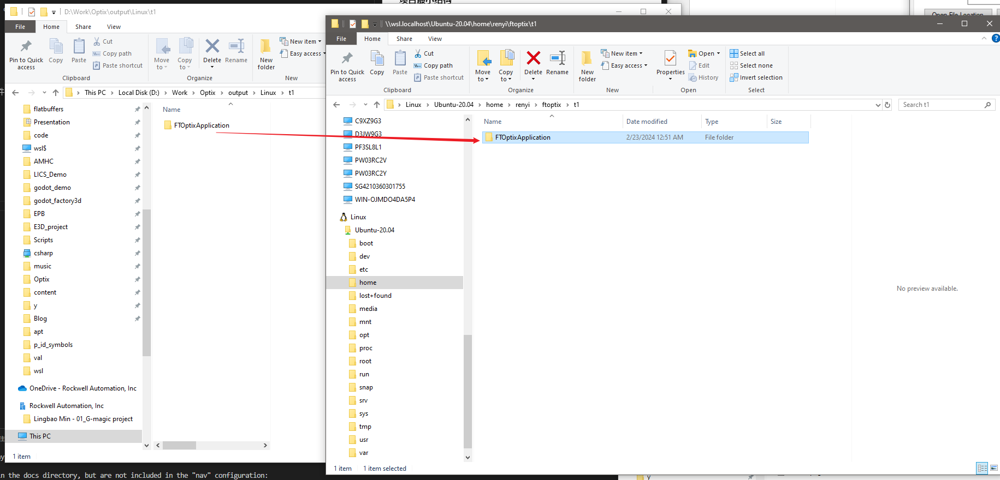
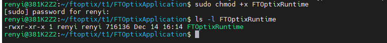
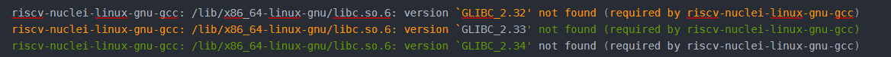
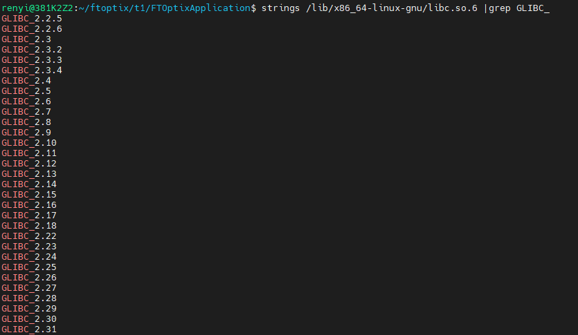
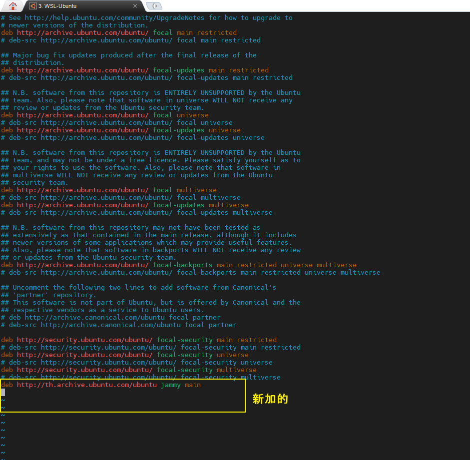
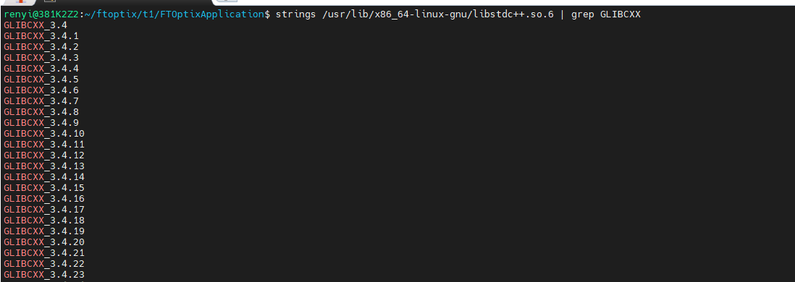

**在WSL中部署 Optix Runtime 的踩坑记录** 

### 0.环境

|参数|值|
|--|--|
|CPU|ntel(R) Core(TM) i7-9850H CPU @ 2.60GHz   2.59 GHz|
|RAM|32GB|
|OS|Windows 10 22H2|
|FTOptix|V1.3.0.968|
|WSL|Ubuntu 20.04.6 LTS|

### 1.安装 WSL

[官方手册](https://learn.microsoft.com/zh-cn/windows/wsl/install)

- cmd命令行

```cmd
wsl --install -d Ubuntu
```

- 完成后重启
成功后在开始菜单中有 Ubuntu for window 软件


- 设置用户名和密码


### 2.运行 WSL for Ubuntu

- 开始菜单中运行


- 启动成功后出现如下命令行窗口


- 检查版本



内核信息
```
cat /proc/version
```
分支信息
```
lsb_release -a 
```


### 3.依赖升级

命令行
```
sudo apt-get update

sudo apt-get upgrade -y

sudo apt-get install -y curl openssh-server ca-certificates tzdata perl

```


### 4.导出项目并部署

- FTOptix 项目
    因为WSL不含Ubuntu的界面组件，所有FTOptix项目的发布引擎 **只能** WebPresentationEngine

**项目最小结构**



- 导出 Ubuntu Runtime



- 复制到wsl中


- 修改FTOptixRuntime的运行权限

    - 在 WSL中 ，CD 到 FTApplication目录


    - 修改权限
  ```
  改权限
  sudo chmod +x ./FTOptixRuntime
  
  检查权限
  ls -l FTOptixRuntime
  ```



- 运行

```
./FTOptixRuntime
```
如果没有出错信息，就可在 本机上通过浏览器进入到Application中
效果如下:


---

### 报错处理

#### 1.libc.so.6 version `GLIBC_2.34` not found
如果出现如下错误提示



检查版本

```
strings /lib/x86_64-linux-gnu/libc.so.6 |grep GLIBC_
```



缺了GLIBC_2.34 等等版本


**解决方案**

添加一个高级版本系统的源，直接升级libc6.

Ubuntu 20.04 - added this repo as described in the link

* 编辑源
```
sudo vi /etc/apt/sources.list
```


* 添加高版本的源 到最末端
```
deb http://th.archive.ubuntu.com/ubuntu jammy main    #添加该行到文件
```




* 运行升级
```
sudo apt update

sudo apt install libc6
```


* 查看结果
```
renyi@381K2Z2:~/ftoptix/t1/FTOptixApplication$ strings /lib/x86_64-linux-gnu/libc.so.6 |grep GLIBC_
GLIBC_2.2.5
GLIBC_2.2.6
GLIBC_2.3
GLIBC_2.3.2
GLIBC_2.3.3
GLIBC_2.3.4
GLIBC_2.4
GLIBC_2.5
GLIBC_2.6
GLIBC_2.7
GLIBC_2.8
GLIBC_2.9
GLIBC_2.10
GLIBC_2.11
GLIBC_2.12
GLIBC_2.13
GLIBC_2.14
GLIBC_2.15
GLIBC_2.16
GLIBC_2.17
GLIBC_2.18
GLIBC_2.22
GLIBC_2.23
GLIBC_2.24
GLIBC_2.25
GLIBC_2.26
GLIBC_2.27
GLIBC_2.28
GLIBC_2.29
GLIBC_2.30
GLIBC_2.31
GLIBC_2.32
GLIBC_2.33
GLIBC_2.34
GLIBC_2.35
GLIBC_PRIVATE
```


#### 2.libc.so.6 version `GLIBCXX_3.4.29` not found 

**检查**

* 使用指令先看下系统目前都有哪些版本的
```
strings /usr/lib/x86_64-linux-gnu/libstdc++.so.6 | grep GLIBCXX
```


所以确定是缺少GLIBCXX_3.4.29

**解决方案**

* 拷贝一个高版本的 libstd++.so.6
* 复制到指定目录并建立新的链接
```
# 复制
sudo cp <新版本的路径>/libstdc++.so.6.0.29 /usr/lib/x86_64-linux-gnu/

# 删除之前链接
sudo rm /usr/lib/x86_64-linux-gnu/libstdc++.so.6

# 创建新的链接
sudo ln -s /usr/lib/x86_64-linux-gnu/libstdc++.so.6.0.29 /usr/lib/x86_64-linux-gnu/libstdc++.so.6
```
  之后程序一般是能够成功运行的
* 【注意】有时候由于权限问题，我们需要查看它们的权限
```
ll /usr/lib/x86_64-linux-gnu/libstd*
```
