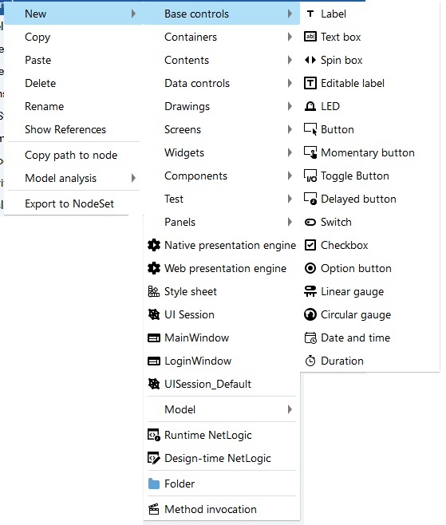
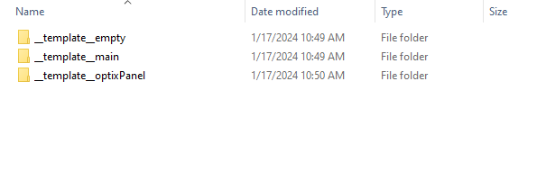

### 改变右键的内容
路径 : [....]/FactoryTalk Optix/Studio/HMIProjectDesign/HMIProjectDesign.xml

里面的内容都是右键新建里面的内容

---

### 模型项目内容

C:\Program Files\Rockwell Automation\FactoryTalk Optix\Studio\Files\ProjectTemplates

如上图所示,分别对应 空模板，主模板，平板HMI